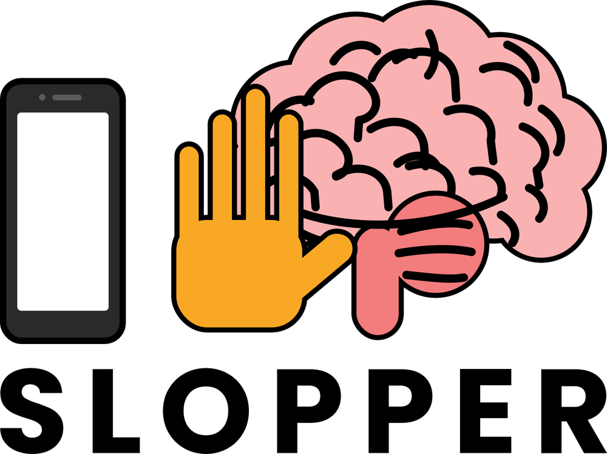

**Helps you to stop watching slop/brainrot content, and allows you to track your activity on your PC.**

# About Slopper
This is a (personal) activity tracker that monitors on what you spend your time on, and how much; More specifically on 'brainrot/slop' content.

Slopper has two halves that 'work together': 
- **Chrome extension** - Detects when you're watching brainrot/slop content on certain websites, counts the time you *actively* spend on them (ignoring background
  tabs), and saves the running total time of these.<br>
  Once you pass a time limit, and depending on the mode you chose, the extension will (help) stop the watching of this content on those websites, and any further visits for that day.<br>
- **Python tracker** - Application that watches your desktop applications, and can make future predictions based on your activity (Currently still work in progress).

Currently it runs on the following websites:

| Status | Website | Notes |
|------|------|------|
| Works | YouTube Shorts |
| Works | Instagram Reels |
| Works | TikTok |
| Works | Facebook |
| Partially | Twitter/X | The small (autoplaying) videos are the same size as grid previews, causing them to not be counted on the tracker. |

## Installation

### Chrome Extension
**Option A — If you ONLY want to USE the extension, add it from the Chrome Web Store here ->** [Slopper](https://chromewebstore.google.com/detail/agdjpbclibfpgkmhjmhjmopogmmnmmac?utm_source=item-share-cb)

*If you want to read/modify the code, do either of the following options below:*

**Option B — download:** Download this ZIP and unpack it somewhere on your PC.

**Option C — clone:**
```bash
git clone https://github.com/rick9117/slopper.git
```
> ⚠️ Keep the folder where you put it as Chrome loads the extension from this
> exact location, moving or deleting it will break the extension.

1. Go to `chrome://extensions`
2. Enable **Developer mode** (toggle on, top-right)
3. Click **Load unpacked**
4. Select the **`extension/`** folder inside the project (not the project root)

### Python Tracker (Work in progress)
Not ready for use yet.

## Roadmap

- [X] ~~**Get the project up and running in its basic form**~~
- [X] ~~**Track other sites**~~
  - [X] ~~Instagram Reels~~
  - [X] ~~TikTok~~
  - [X] ~~Facebook~~
  - [X] ~~Twitter/X~~
- [X] ~~**Add two modes ('Mom' & 'Dad')**~~
  - [X] ~~'Mom' mode: suggests you turn off the slop.~~
  - [X] ~~'Dad' mode: forcefully turns it off for you (real enforcement — block scrolling / close the tab, not just a warning).~~
    - [X] ~~Optional NSFW version that's more aggressive/verbal~~
- [ ] **Tracker Customization**
  - [ ] Allows the user to change the time of the tracker (and colour of the pop-up?)
- [ ] **A dashboard with daily and weekly activity graphs (similar to ActivityWatch)**
  - [ ] Categorize activity (work, social, entertainment, etc.)
  - [ ] Predict future usage from past patterns